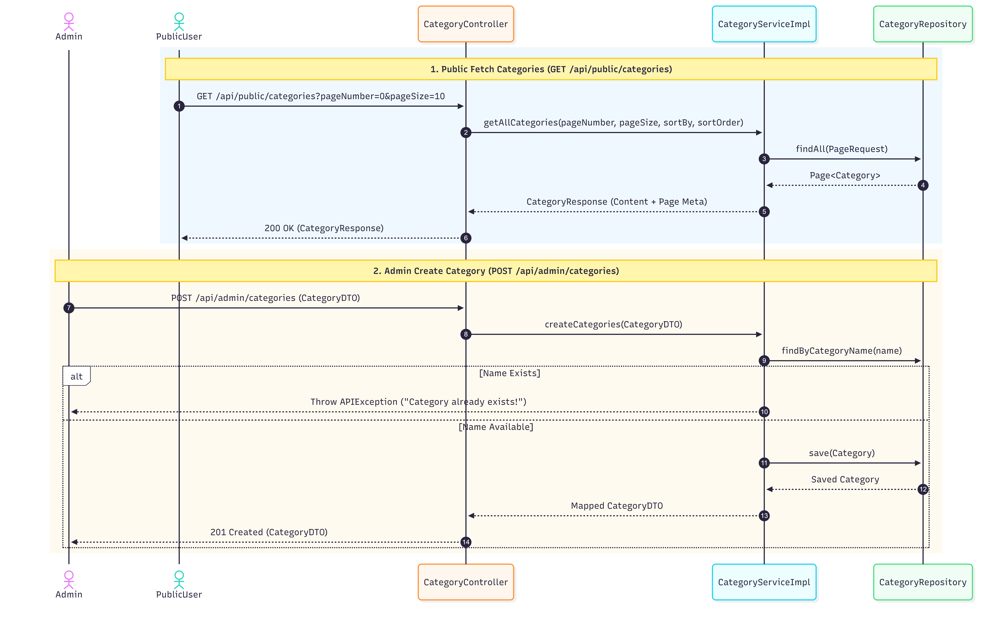
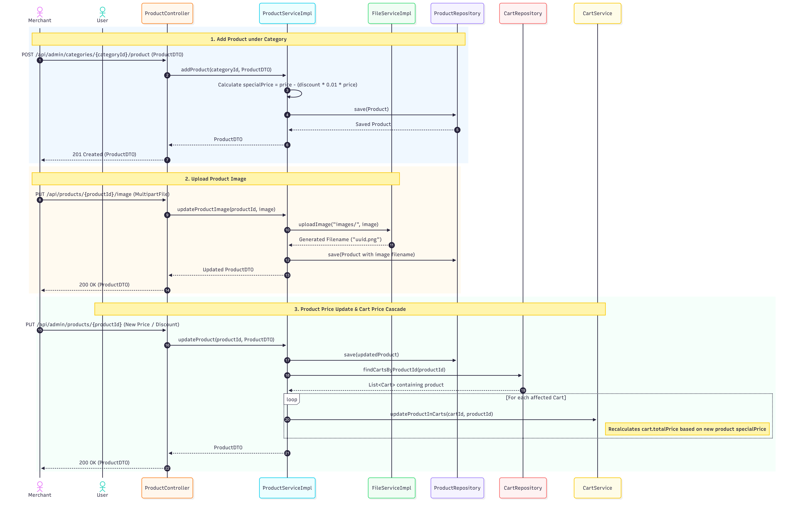
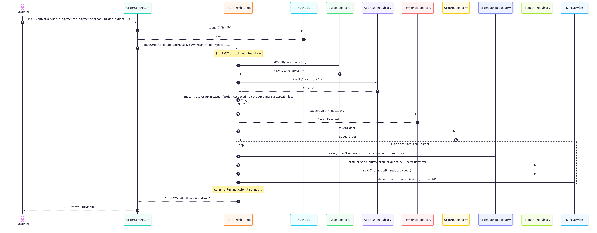

# 06. End-to-End API Sequence Diagrams

This document presents comprehensive **Mermaid Sequence Diagrams** covering all primary execution paths and API interaction flows across the Shoply system architecture.

---

## 1. Authentication & Stateful Signout Workflow

---

## 2. Category Management Workflow

---

## 3. Product Catalog & Image Upload Workflow

---

## 4. Shopping Cart Workflow

---

## 5. Order Checkout Workflow (`@Transactional`)

