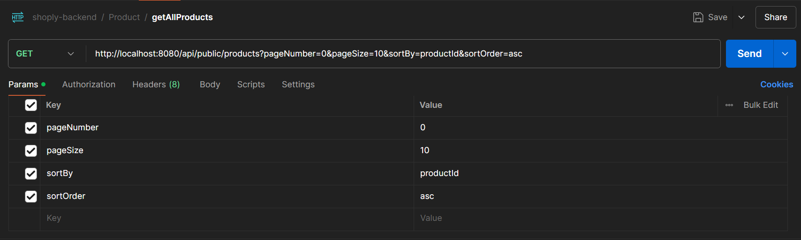
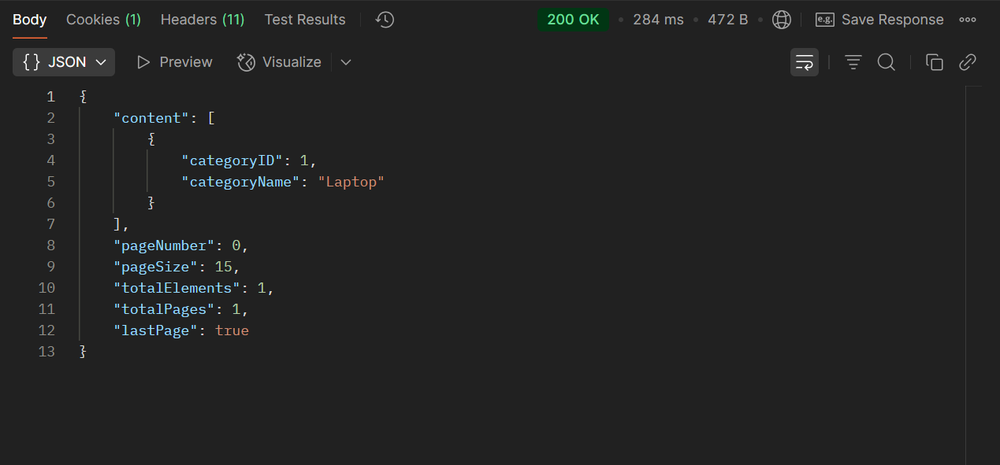

# GetAllCategories Api Flow:

- Here we will define how this part of crud operation is designed here
- This is an operation to get all the categories from the database.

###  Step 1: We will need to create a connection with the database to read the data.

```properties
#application.properties
spring.application.name=shoply-backend

spring.datasource.url=jdbc:postgresql://localhost:5432/shoplydb
spring.datasource.username=postgres
spring.datasource.password=RahulRai

spring.jpa.hibernate.ddl-auto=update
spring.jpa.show-sql=true

```

- First line contains the spring application name.
- Then we have the configuration for the database connection
- Then we have, hibernate configurations to where we allow the hibernate to create queries and perform operations.

--- 

### Step 2 : Create The Entity for our application.

```java
// Category.java
package com.shoply.backend.model;

import jakarta.persistence.Entity;
import jakarta.persistence.GeneratedValue;
import jakarta.persistence.GenerationType;
import jakarta.persistence.Id;
import jakarta.validation.constraints.NotBlank;
import jakarta.validation.constraints.Size;
import lombok.AllArgsConstructor;
import lombok.Data;
import lombok.NoArgsConstructor;

@Entity(name = "categories")
@Data
@NoArgsConstructor
@AllArgsConstructor
public class Category {
    @Id
    @GeneratedValue(strategy = GenerationType.IDENTITY)
    private Long categoryId;

    @NotBlank
    @Size(min = 5, message = "Category name must be at least 5 characters long")
    @Size(max = 50, message = "Category name must be at most 50 characters long")
    private String categoryName;
}
```

- This is the entity class we have created which is used in the context of Object-Relational Mapping (ORM), such as when using JPA (Java Persistence API) with frameworks like Hibernate. They represent database tables as Java objects, allowing developers to interact with a database using object-oriented programming rather than SQL queries.
- Here we also need to create getter and setter and constructor both args and no-args. Here we have implemented it using lombok.

#### No-Args constructor : 
- Required by JPA/Hibernate, Hibernate and other JPA providers use reflection to create entity instances. A no-args constructor is necessary for this process.
- Also, Hibernate often creates proxy objects (lazy loading). A no-args constructor helps in dynamically creating instances.
- Also, If the entity is used in serialization/deserialization (e.g., JSON, XML), a default constructor ensures proper instantiation.

#### Args constructor (Parameterized Constructor):
- This is for the convenience for Object Creation, allows creating an instance with initial values without setting fields manually.
- Also, ensures Immutability. If fields are final, an all-args constructor is necessary.
- It Can also be used in DTO patterns, Helps in converting between Entity & DTOs (Data Transfer Objects).

---

### Step 3 : Create a Repository layer

```java
//CategoryRepository
package com.shoply.backend.repositories;

import com.shoply.backend.model.Category;
import org.springframework.data.jpa.repository.JpaRepository;

public interface CategoryRepository extends JpaRepository<Category, Long> {
  
}
```
- The Repository Layer is a crucial part of the Spring Boot architecture (or any layered architecture in Java applications). It acts as an abstraction over data access logic, making interactions with databases cleaner and more manageable.
- The repository layer hides complex SQL queries, ensuring that the service layer doesn't directly interact with the database.
- ORM frameworks like Spring Data JPA and Hibernate optimize queries using caching, lazy loading, and batching.

---

### Step 4 : Create DTO for the entity 

```java
// CategoryDTO
package com.shoply.backend.payload;

import lombok.AllArgsConstructor;
import lombok.Data;
import lombok.NoArgsConstructor;

@Data
@NoArgsConstructor
@AllArgsConstructor
public class CategoryDTO {
    private Long categoryID;
    private String categoryName;
}

```

- The DTO(Data transfer object) Layer is used to transfer data between different layers of an application while keeping concerns separate. 
- It helps in structuring the data properly and prevents unnecessary exposure of sensitive or internal entity details.
- It helps to achieve Encapsulation & Abstraction.
- DTOs prevent direct exposure of database entities to external layers (e.g., API responses).
- Helps protect sensitive fields (e.g., passwords, internal IDs). This is done as if you return the response using the entity directly you will the return all the tables and values in db.
- So if you need to hide a certain field you can use DTO, as here we will only display what's necessary.
- Summery: It helps in decoupling the database entity from the API response.

---

### Step 5 : Create a Response layer for the category 

```java
// CategoryResponse
package com.shoply.backend.payload;

import lombok.AllArgsConstructor;
import lombok.Data;
import lombok.NoArgsConstructor;

import java.util.List;

@Data
@NoArgsConstructor
@AllArgsConstructor
public class CategoryResponse {
    private List<CategoryDTO> content;
    private Integer pageNumber;
    private Integer pageSize;
    private Long totalElements;
    private Integer totalPages;
    private boolean lastPage;
}
```
- Now with this layer you might be thinking why are we creating so many layers for Data transfer.
- This is done so that we can promote loose coupling and follow best practices for software design like separation of concern(SoC).
- Now lets talk about This layer, this is the known as a response object.
- This is used to help Helps API consumers handle large data sets.
- We can use Response objects for various use cases.
- They can be used to improve API structure, error handling, and maintainability, etc.
- In this project we have used it for implementing pagination concept as you can see, 
  - `content`: this will have the response according to dto.
  - `pageNumber`, `pageSize`, `totalElements`, `totalPages`, `lastPage`: Pagination concepts.
- So to return a combined structure for this we have use Response Object.

---

### Step 6 : Create the service layer

- The service layer consists of two files one will the a interface and then other is the implementation of the interface.
- In our case we have : `CategoryService` `CategoryServiceImpl`.
- The interface defines what the service should do (contract). 
- The implementation provides how it does it.
- This makes it easy to switch between different implementations without modifying dependent code.
- Benefit: If we later swap CategoryServiceImpl with NewCategoryServiceImpl, we don’t need to change the controller. 
- Since in controller we will be calling the interface not the impl file so, it makes it easier to change business logic or the implementation file.

```java
// CategoryService.java
public interface CategoryService {
  CategoryResponse getAllCategories(Integer pageNumber, Integer pageSize, String sortBy, String sortOrder);
}
```
- So here we have created a getAllCategories function, this will contain the business logic of the function.


```java
//CategoryServiceImpl.java
package com.shoply.backend.service;

import com.shoply.backend.exceptions.APIException;
import com.shoply.backend.exceptions.ResourceNotFoundException;
import com.shoply.backend.model.Category;
import com.shoply.backend.payload.CategoryDTO;
import com.shoply.backend.payload.CategoryResponse;
import com.shoply.backend.repositories.CategoryRepository;
import org.modelmapper.ModelMapper;
import org.springframework.beans.factory.annotation.Autowired;
import org.springframework.data.domain.Page;
import org.springframework.data.domain.PageRequest;
import org.springframework.data.domain.Pageable;
import org.springframework.data.domain.Sort;
import org.springframework.stereotype.Service;
import org.springframework.web.bind.annotation.RequestBody;

import java.util.List;


@Service
public class CategoryServiceImpl implements CategoryService{

    @Autowired
    private CategoryRepository categoryRepository;

    @Autowired
    private ModelMapper modelMapper;


    // getAllCategories is to list All the categories name in the database
    @Override
    public CategoryResponse getAllCategories(Integer pageNumber, Integer pageSize, String sortBy, String sortOrder) {
        // Sorting according to the user need.
        Sort sortByAndOrder = sortOrder.equalsIgnoreCase("asc")
                ? Sort.by(sortBy).ascending()
                : Sort.by(sortBy).descending();

        // This is a class we are using to implement pagination with sorting, this package is from spring data jpa.
        Pageable pageDetails = PageRequest.of(pageNumber, pageSize, sortByAndOrder);
        Page<Category> categoryPage = categoryRepository.findAll(pageDetails);

        // List<Category> categories = categoryRepository.findAll();
        List<Category> categories = categoryPage.getContent();

        if (categories.isEmpty())
            throw new APIException("No category created till now");

        List<CategoryDTO> categoryDTOS = categories.stream()
                .map(category -> modelMapper.map(category, CategoryDTO.class))
                .toList();

        CategoryResponse categoryResponse = new CategoryResponse();
        categoryResponse.setContent(categoryDTOS);
        categoryResponse.setPageNumber(categoryPage.getNumber());
        categoryResponse.setPageSize(categoryPage.getSize());
        categoryResponse.setTotalElements(categoryPage.getTotalElements());
        categoryResponse.setTotalPages(categoryPage.getTotalPages());
        categoryResponse.setLastPage(categoryPage.isLast());
        return categoryResponse;
        
    }
}

```
- Here we can see this class implements the interface.
- In this class we can see we have used dependency injection. `CategoryRepositoy` but why? 
- This is because we will be dealing the crud operation logics(create, read, update, delete) here.
- And the repository layer provides us with inbuilt methods like -
  - `save(S entity)`
  - `saveAll(Iterable<S> entities)`
  - `findById(Id id)`
  - `existsById(Id id)`
  - `findAll()`, etc
- which we can use in our business layer just by creating and object of the repo class.
- Here is also one `ModelMapper`.
- ModelMapper is a Java library used for object mapping. It simplifies the process of converting one Java object type to another.
- Typically used for mapping between DTOs (Data Transfer Objects) and Entities.
- It eliminates the need for manual field-by-field copying and reduces boilerplate code.
- The configuration for ModelMapper in done in AppConfig.java file.

#### AppConfig.java

```java
// AppConfig.java
package com.shoply.backend.config;

import org.modelmapper.ModelMapper;
import org.springframework.context.annotation.Bean;
import org.springframework.context.annotation.Configuration;

@Configuration
public class AppConfig {

    @Bean
    public ModelMapper modelMapper(){
        return new ModelMapper();
    }
}
```
- The `@Bean` annotation in Spring is used to define and register beans in the Spring application context.
- It is commonly used inside a class annotated with `@Configuration` to manually define beans that Spring should manage.

#### Coming back to the CategoryServiceImpl :
- Here we have used `CategoryResponse` as the return type, which means this will return according to the pattern of response object.
- First we are setting a sorting order for the data to return.
- Then we have implemented the logic for Pagination using Pageable class.
- we are passing three values :
  - `PageNumber` : Taking from user but also has a default value as it is not required value. which means user can give it or not.
  - This will specify what page user wants to see. eg: user gives PageNumber as 2.
  - As it starts from 0,1,..
  - And then user provides PageSize as 10. And the total data is 50, then each page will hold 10 elements each.
  - So page 2 will print (21 to 30) elements.
  - `PageSize` : How many enteries will there be in a page.
  - `SortByAndOrder` : Sets the sorting order, here we pass sortBy like which filed to sort by(ID, Name etc). and sort order is asc or desc.
  - once these fields are passed to the Pageable methods, using the pageable object. I 
- This creates a PageRequest object for pagination.
- Fetching Data: Calls categoryRepository.findAll(pageDetails), which:
  - Generates a SQL query with LIMIT and OFFSET.
  - Fetches the required subset of data.
- Handling Empty Data: Throws an exception if no categories exist.
- Entity to DTO Conversion: Uses ModelMapper to convert Category entities to CategoryDTOs.
- Creating Response Object: Fills CategoryResponse with:
  - Data (List<CategoryDTO>)
  - Pagination metadata (total pages, total elements, etc.).
- Returning Response: Sends CategoryResponse to the API consumer.

- ### Note1 : Default values are places in AppConstants.java
- ### Note2 : APIException is from Exception module, a custom exception we have created.

```java
//AppConstants.java
package com.shoply.backend.config;

public class AppConstants {
    public static final String PAGE_NUMBER = "0";
    public static final String PAGE_SIZE = "50";
    public static final String SORT_CATEGORIES_BY = "categoryId";
    public static final String SORT_DIR = "asc";
}

```

```java
//APIException.java
package com.shoply.backend.exceptions;

public class APIException extends RuntimeException {
    private static final long serialVersionUID = 1L;

    public APIException(){
    }
    public APIException(String message) {
        super(message);
    }

}

```
- Yes! When you call APIException and pass a message, it will print the message because it extends RuntimeException, which already has built-in support for handling exception messages.
- When you throw the exception like this: 
```java
throw new APIException("No category created till now");
```
- Internally, it calls the constructor:
```java
public APIException(String message) {
    super(message);
}
```
- Since RuntimeException (parent class) already stores and handles the message, calling getMessage() on the exception will return "No category created till now".


---

### Step 7 : Creating a Controller Layer.

```java
//CategoryController.java
package com.shoply.backend.controller;

import com.shoply.backend.config.AppConstants;
import com.shoply.backend.payload.CategoryDTO;
import com.shoply.backend.payload.CategoryResponse;
import com.shoply.backend.service.CategoryService;
import jakarta.validation.Valid;
import org.springframework.beans.factory.annotation.Autowired;
import org.springframework.http.HttpStatus;
import org.springframework.http.ResponseEntity;
import org.springframework.web.bind.annotation.*;


@RestController
@RequestMapping("/api") // This help to define path of endpoint at class level.
public class CategoryController {

  @Autowired
  private CategoryService categoryService;


  @GetMapping("/public/categories")
  public ResponseEntity<CategoryResponse> getAllCategories(
          @RequestParam(name = "pageNumber", defaultValue = AppConstants.PAGE_NUMBER, required = false) Integer pageNumber,
          @RequestParam(name = "pageSize", defaultValue = AppConstants.PAGE_SIZE, required = false) Integer pageSize,
          @RequestParam(name = "sortBy", defaultValue = AppConstants.SORT_CATEGORIES_BY, required = false) String sortBy,
          @RequestParam(name = "sortOrder", defaultValue = AppConstants.SORT_DIR, required = false) String sortOrder) {
    CategoryResponse categories = categoryService.getAllCategories(pageNumber, pageSize, sortBy, sortOrder);
    return new ResponseEntity<>(categories, HttpStatus.OK);
  }
}
```

- This method is a REST API endpoint that fetches a paginated list of categories and returns it as a ResponseEntity with HTTP status 200 OK.
- Now you can see in this layer all we need to do is just call the service layer logic to get data from the database.
- we have used ResponseEntity to handle the response and status.

#### Here we are done with the implementation of getAllCategories, new we will be doing for other operations as well.

## API IN POSTMAN


- Here we can see that we are only passing params, which also have a default value in backend.
- So any can be used either default or provided by the user.

###  `Response Body` :

- This is the response we get also there is one response for no category present.
- 

