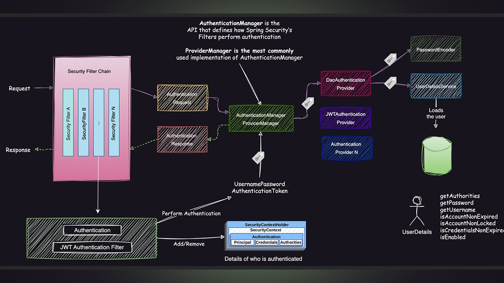

# Let's Discuss the Architecture of Spring Security :



## How Spring security works | Flow and internal Details :

- In a normal spring boot application we have controllers, Using which we 
  - Where we receive requests.
  - Return Response.
- So In general a request is needed to go through a series of filers (also known as filter chains) to reach to the controller.
  - There can be many filters depending on what we are configuring.
  - THe filter have specific jobs related to their configuration.
  - So when you are using `Spring Security` there is a specific filter Known as `(Authentication filter)`. There are more filters with spring security. 
  - But for now we will talk about the Authentication Filter.

## What is `Authentication Filter`?

---

- In `Spring Security`, the `authentication filter` plays a crucial role in processing and validating user authentication.
- The flow of the `authentication filter` involves several key components working together to handle the authentication process.


###  **Flow of Authentication Filter in Spring Security**

### `1. Request Interception`
- A user sends a request (like a login attempt) to the server.
```json
{
  "username": "john_doe",
  "password": "password123"
}
```
- The request is intercepted by the **`FilterChain`**, which is managed by the **`DelegatingFilterProxy`** from the servlet container.


### **`2. Delegation to Spring Security Filter Chain`**
- The request is passed to the **`SecurityFilterChain`**.
- The `SecurityFilterChain` contains a list of filters registered by Spring Security (e.g., `UsernamePasswordAuthenticationFilter`, `BasicAuthenticationFilter`, `JwtAuthenticationFilter`, etc.).

### **`3. Authentication Filter Handling`**
- A specific authentication filter (e.g., `UsernamePasswordAuthenticationFilter`) checks if the request matches its criteria (e.g., login endpoint `/login`).
- If the request matches:
  - The filter attempts to extract credentials (like username and password) from the request.
  - Creates an `Authentication` object (e.g., `UsernamePasswordAuthenticationToken`) with the extracted data.
```json
{
  "type": "UsernamePasswordAuthenticationToken",
  "principal": "john_doe",
  "credentials": "password123"
}
```
- The `Authentication` object is passed to the `AuthenticationManager`.


### **`4. Delegation to AuthenticationManager`**
- The filter calls the `AuthenticationManager`'s `authenticate()` method.
- The `AuthenticationManager` is responsible for selecting the appropriate **`DaoAuthenticationProvider`** based on the type of `Authentication` object.
```json
{
  "type": "DaoAuthenticationProvider",
  "authenticationToken": {
    "principal": "john_doe",
    "credentials": "password123"
  }
}
```


### **5. Authentication by `AuthenticationProvider`**
- The `AuthenticationProvider` (like `DaoAuthenticationProvider`) attempts to authenticate the user:
  - Retrieves user details from `UserDetailsService`.
  - Verifies credentials using a `PasswordEncoder`, this compares the raw password with the encoded password.
  - If successful, returns a fully populated `Authentication` object.
  - If authentication fails, an `AuthenticationException` is thrown.

- **UserDetailsService returns :**
```json
{
  "username": "john_doe",
  "password": "$2a$10$E8NQ8jJk4L.kZVV1QOrI2u.h/eLzzEvD3kXKiN/XAEJ9JqEuoTQTu", // BCrypt hashed password
  "roles": ["USER"]
}
```

### **6. Successful Authentication**
- The filter receives the authenticated `Authentication` object.
- The `SecurityContextHolder` is populated with the `Authentication` object.
- A successful authentication handler (e.g., `SavedRequestAwareAuthenticationSuccessHandler`) is called:
  - Redirects user to the intended URL or a default success URL.

**Authentication object :** 
```json
{
  "type": "UsernamePasswordAuthenticationToken",
  "principal": "john_doe",
  "authorities": ["ROLE_USER"],
  "authenticated": true
}
```

**Success Handler Response :**
```json
{
  "status": 200,
  "message": "Login successful",
  "user": {
    "username": "john_doe",
    "roles": ["ROLE_USER"]
  },
  "redirectUrl": "/home"
}
```


### **7. Failed Authentication**
- If authentication fails:
  - An `AuthenticationFailureHandler` (e.g., `SimpleUrlAuthenticationFailureHandler`) is triggered.
  - Handles failure response (like returning `401 Unauthorized`).

**Example Wrong Password Request:**
```json
{
  "username": "john_doe",
  "password": "wrongpassword"
}
```

**AuthenticationFailureHandler Response:**
```json
{
  "status": 401,
  "error": "Unauthorized",
  "message": "Invalid username or password"
}
```


### **8. Continue Filter Chain**
- After processing by the authentication filter:
  - The request is passed to the next filter in the chain (e.g., `AuthorizationFilter`) if authentication is successful.
  - If authentication fails, the request is terminated.

---

##  **Example: UsernamePasswordAuthenticationFilter Flow**
1. User sends a `POST` request to `/login` with username and password.
2. `UsernamePasswordAuthenticationFilter` intercepts the request.
3. Credentials are extracted and wrapped in `UsernamePasswordAuthenticationToken`.
4. `AuthenticationManager` calls `DaoAuthenticationProvider`.
5. `DaoAuthenticationProvider`:
  - Loads user from `UserDetailsService`.
  - Verifies password using `PasswordEncoder`.
6. If successful :
  - `SecurityContextHolder` is populated.
  - Redirect to success URL.
7. If failed :
  - `AuthenticationFailureHandler` is triggered.

---

##  **Main Components Involved**
| Component | Description |
|-----------|-------------|
| **DelegatingFilterProxy** | Registers Spring Security filters with the servlet container. |
| **SecurityFilterChain** | Defines the order of Spring Security filters. |
| **AuthenticationManager** | Delegates to appropriate `AuthenticationProvider`. |
| **AuthenticationProvider** | Responsible for authenticating user credentials. |
| **UserDetailsService** | Loads user-specific data. |
| **PasswordEncoder** | Encodes and matches passwords. |
| **SecurityContextHolder** | Stores the authenticated `Authentication` object. |
| **AuthenticationSuccessHandler** | Handles successful authentication. |
| **AuthenticationFailureHandler** | Handles failed authentication. |

---

##  **Summary of Flow**
1. Request ➡️ FilterChain ➡️ AuthenticationFilter ➡️ AuthenticationManager ➡️ AuthenticationProvider ➡️ Success/Failure Handler ➡️ FilterChain (if success)

