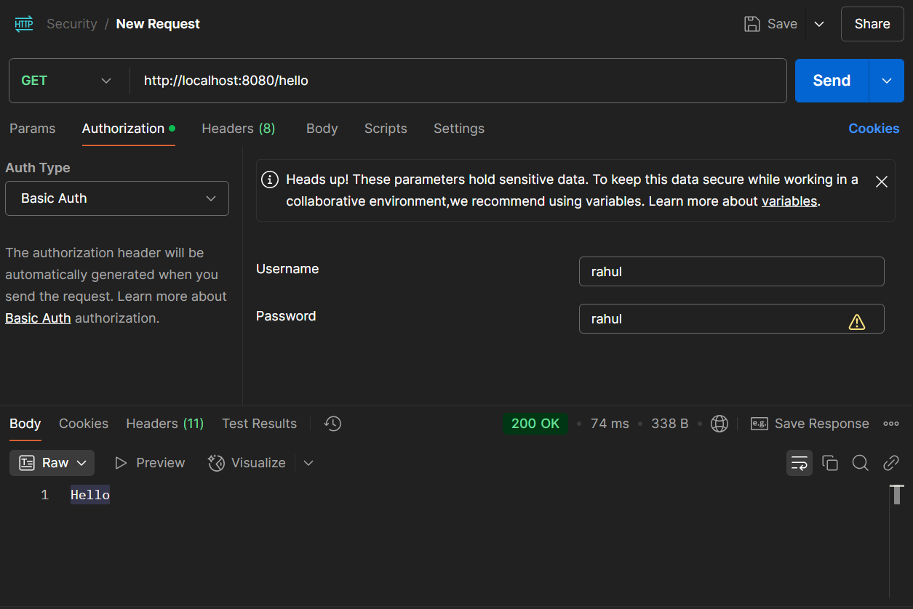
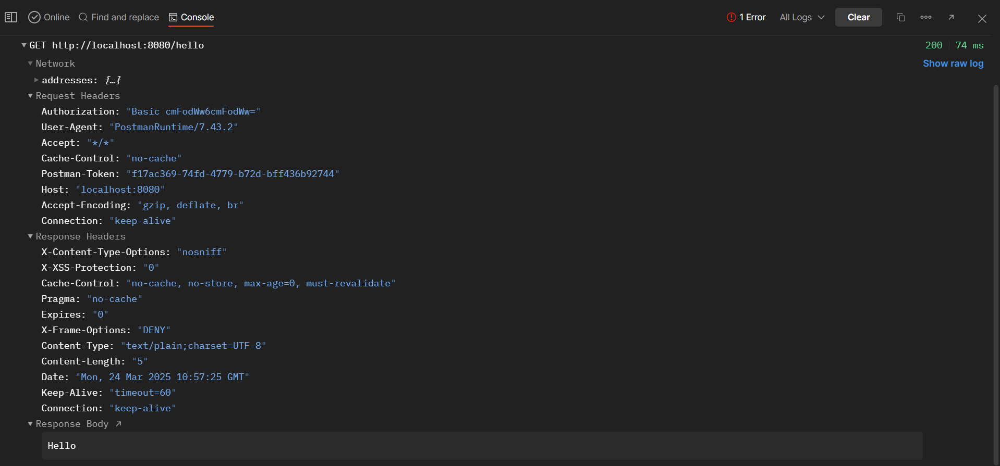

# Spring Security Implementation :

## Step 1 : We will start by creating a project first:
- We need to go to the spring initializer website : https://start.spring.io/index.html
- This is where we need to create project 
  - Project : `Maven` 
  - Language : `Java`
  - Spring Boot : Use the latest one.(Don't configure Snapshot).
  - Project metadata : add whatever you need.
  - packing : `jar`
  - java : `17` 
  - Dependencies : `Spring web`, `Spring Security`.
- Now project is created.


## Step 2 : Lets create a controller layer:
```java
// GreetingsController.java
package com.SpringSecurityProject.demo;

import org.springframework.web.bind.annotation.GetMapping;
import org.springframework.web.bind.annotation.RestController;

@RestController
public class GreetingsController {

    @GetMapping("/hello")
    public String sayHello(){
        return "Hello";
    }
}
```
- Now to check you can just run the application. 
- You will see a Login page automatically being shown.
    - The `id` will be `user` by default.
    - Amd the `passowrd` will be shown in the terminal.
    - 
- This is added because of the spring security we added.
- It is called the Default behaviour of spring security.


## Step 3: Custom username and password:

- You can set your username and password in the `application.properties`.

```properties
spring.application.name=demo

spring.security.user.name = rahul
spring.security.user.password = rahul
```


## Step 4 : writing your own Security Filter.

- For default configuration you will find the related setting in files like `SpringBootWebSecurityConfiguration.java`.
- To override it you need to define a class configuration and create a `securityFilterChain`.
- So to implement our own rule lets create a `SecurityConfig` file of our own.
```java
// SecurityConfig.java

package com.SpringSecurityProject.demo;

import org.springframework.context.annotation.Bean;
import org.springframework.context.annotation.Configuration;
import org.springframework.security.config.annotation.web.builders.HttpSecurity;
import org.springframework.security.config.annotation.web.configuration.EnableWebSecurity;
import org.springframework.security.config.annotation.web.configurers.AuthorizeHttpRequestsConfigurer;
import org.springframework.security.web.SecurityFilterChain;

import static org.springframework.security.config.Customizer.withDefaults;

@Configuration
@EnableWebSecurity
public class SecurityConfig {

  @Bean
  SecurityFilterChain defaultSecurityFilterChain(HttpSecurity http) throws Exception {
    http.authorizeHttpRequests((requests) -> {
      ((AuthorizeHttpRequestsConfigurer.AuthorizedUrl)requests.anyRequest()).authenticated();
    });
    // http.formLogin(withDefaults());
    http.httpBasic(withDefaults());
    return http.build();
  }
}

```
- Now we can use our custom filter to authenticate.
- You can use any one at `formlogin` or `httpBasic`
- Using both together will show some unusual behaviour.
- It also maintains your session like once you login username and password you can have access till you logout in form based.
  - To logout you need to goto `localhost:8080/logout`.
- for basic there is no logout part.
- But it will also have session till you terminate the application.


## Step 5 : Let make Basic authentication stateless :

- By default, nature of `basic authentication(httpBasic)` is `stateful` which me we are able to see cookies stored in the web.
- Therefore, we need to make it stateless, so it won't have any data.
- To do that we need to add some simple configuration in the code.

```java
// SecurityConfig.java

package com.SpringSecurityProject.demo;

import org.springframework.context.annotation.Bean;
import org.springframework.context.annotation.Configuration;
import org.springframework.security.config.annotation.web.builders.HttpSecurity;
import org.springframework.security.config.annotation.web.configuration.EnableWebSecurity;
import org.springframework.security.config.annotation.web.configurers.AuthorizeHttpRequestsConfigurer;
import org.springframework.security.config.http.SessionCreationPolicy;
import org.springframework.security.web.SecurityFilterChain;

import static org.springframework.security.config.Customizer.withDefaults;

@Configuration
@EnableWebSecurity
public class SecurityConfig {

    @Bean
    SecurityFilterChain defaultSecurityFilterChain(HttpSecurity http) throws Exception {
        http.authorizeHttpRequests((requests) -> {
            ((AuthorizeHttpRequestsConfigurer.AuthorizedUrl)requests.anyRequest()).authenticated();
        });
        
        // Below line is what we used to make the session stateless
        http.sessionManagement(session
                -> session.sessionCreationPolicy(SessionCreationPolicy.STATELESS));
        // http.formLogin(withDefaults());
        http.httpBasic(withDefaults());
        return http.build();
    }
}

```

## Step 6 : Lets hit our api in the postman:



- Here we are passing the credentials through the Authorization area.
- We have selected Basic auth as Auth Type.

### Its Console to check what it returns.



- Now here at auth you can see it says Basic, which means it is encoded with base64.
- As our username = rahul and passoword = rahul, therefor it would be something like rahul:rahul.
- And in authorization it is returned in base64 form.
- `rahul:rahul` is same as `cmFodWw6cmFodWw=`


## Step 7 : Lets create In Memory Users.

- We will be creating in memory user to save and manage multiple users for now.
- We acheive it using `InMemoryUserDetialsManager`.
- `InMemoryUserDetailsManager` is a concrete implementation of the `UserDetailsService` interface provided by Spring Security. 
- It allows you to store user credentials (such as usernames, passwords, and roles) **in-memory** rather than in a database or external system.
- We will be using it for testing as we haven't configured any database yet.

```java
// SecurityConfig.java

package com.SpringSecurityProject.demo;

import org.springframework.context.annotation.Bean;
import org.springframework.context.annotation.Configuration;
import org.springframework.security.authentication.CachingUserDetailsService;
import org.springframework.security.config.annotation.web.builders.HttpSecurity;
import org.springframework.security.config.annotation.web.configuration.EnableWebSecurity;
import org.springframework.security.config.annotation.web.configurers.AuthorizeHttpRequestsConfigurer;
import org.springframework.security.config.http.SessionCreationPolicy;
import org.springframework.security.core.userdetails.User;
import org.springframework.security.core.userdetails.UserDetails;
import org.springframework.security.core.userdetails.UserDetailsService;
import org.springframework.security.provisioning.InMemoryUserDetailsManager;
import org.springframework.security.web.SecurityFilterChain;

import static org.springframework.security.config.Customizer.withDefaults;

@Configuration
@EnableWebSecurity
public class SecurityConfig {

    @Bean
    SecurityFilterChain defaultSecurityFilterChain(HttpSecurity http) throws Exception {
        http.authorizeHttpRequests((requests) -> {
            ((AuthorizeHttpRequestsConfigurer.AuthorizedUrl)requests.anyRequest()).authenticated();
        });
        http.sessionManagement(session
                -> session.sessionCreationPolicy(SessionCreationPolicy.STATELESS));
        // http.formLogin(withDefaults());
        http.httpBasic(withDefaults());
        return http.build();
    }

    @Bean
    public UserDetailsService userDetailsService(){
        UserDetails user1 = User.withUsername("user1")
                .password("{noop}password1")   // {noop} - allows spring boot to save password in plain text format. This is not best practice.
                .roles("USER")
                .build();

        UserDetails admin = User.withUsername("admin")
                .password("{noop}adminPass")
                .roles("ADMIN")
                .build();

        return new InMemoryUserDetailsManager(user1,admin);
    }
}

```
- Now if you check you will be able to see that you will be able to login using both users.


## Step 8 : Lets now setup Role based access in the same projects 

- To implement this we will be using annotations like using 
  - `@PreAuthorize` in the controllers and,
  - `@EnableMethodSecurity` in the security config, you can find more about this in at `14_RoleBasedAccess.md` file.


- Updated GreetingsController
```java
// GreetingsController

package com.SpringSecurityProject.demo;

import org.springframework.security.access.prepost.PreAuthorize;
import org.springframework.web.bind.annotation.GetMapping;
import org.springframework.web.bind.annotation.RestController;

@RestController
public class GreetingsController {

  @GetMapping("/hello")
  public String sayHello(){
    return "Hello";
  }

  @PreAuthorize("hasRole('USER')")
  @GetMapping("/user")
  public String userEndPoint(){
    return "Hello, user!";
  }

  @PreAuthorize("hasRole('ADMIN')")
  @GetMapping("/admin")
  public String adminEndPoint(){
    return "Hello, admin!";
  }


}

```
- Here we have added `@PreAuthorize` and we need to add `@EnableMethodSecurity` in the securityConfig as well.


- Updated SecurityConfig
```java
// SecurityConfig

package com.SpringSecurityProject.demo;

import org.springframework.context.annotation.Bean;
import org.springframework.context.annotation.Configuration;
import org.springframework.security.authentication.CachingUserDetailsService;
import org.springframework.security.config.annotation.method.configuration.EnableMethodSecurity;
import org.springframework.security.config.annotation.web.builders.HttpSecurity;
import org.springframework.security.config.annotation.web.configuration.EnableWebSecurity;
import org.springframework.security.config.annotation.web.configurers.AuthorizeHttpRequestsConfigurer;
import org.springframework.security.config.http.SessionCreationPolicy;
import org.springframework.security.core.userdetails.User;
import org.springframework.security.core.userdetails.UserDetails;
import org.springframework.security.core.userdetails.UserDetailsService;
import org.springframework.security.provisioning.InMemoryUserDetailsManager;
import org.springframework.security.web.SecurityFilterChain;

import static org.springframework.security.config.Customizer.withDefaults;

@Configuration
@EnableWebSecurity
@EnableMethodSecurity
public class SecurityConfig {

  @Bean
  SecurityFilterChain defaultSecurityFilterChain(HttpSecurity http) throws Exception {
    http.authorizeHttpRequests((requests) -> {
      ((AuthorizeHttpRequestsConfigurer.AuthorizedUrl)requests.anyRequest()).authenticated();
    });
    http.sessionManagement(session
            -> session.sessionCreationPolicy(SessionCreationPolicy.STATELESS));
    // http.formLogin(withDefaults());
    http.httpBasic(withDefaults());
    return http.build();
  }

  @Bean
  public UserDetailsService userDetailsService(){
    UserDetails user1 = User.withUsername("user1")
            .password("{noop}password1")   // {noop} - allows spring boot to save password in plain text format. This is not best practice.
            .roles("USER")
            .build();

    UserDetails admin = User.withUsername("admin")
            .password("{noop}adminPass")
            .roles("ADMIN")
            .build();

    return new InMemoryUserDetailsManager(user1,admin);
  }


}

```

- This will enable `Role Based Access` for your website.

## Step 8 : Now let's create a database setup :

- I will be configuring H2 Database for now but the steps will remain same.
- Making changes to the application.properties file.

```properties
spring.application.name=demo

spring.security.user.name = rahul
spring.security.user.password = rahul

spring.h2.console.enabled=true
spring.datasource.url=jdbc:h2:mem:test
```

- Now we will be able to access the h2-console.
- But here when you will try to access "http://localhost:8080/h2-console/", you will see that we are needed to add `username` and `password`.
- This happens because we have configured our application with `spring security` so now all the routes that are available through the application will need authentication.
- Now we can simply use it using the credentials, or we can just add some configurations to remove `spring security`.

- The change will be made in the `SpringConfig` file :
```java
//SecurityConfig

package com.SpringSecurityProject.demo;

import org.springframework.context.annotation.Bean;
import org.springframework.context.annotation.Configuration;
import org.springframework.security.authentication.CachingUserDetailsService;
import org.springframework.security.config.annotation.method.configuration.EnableMethodSecurity;
import org.springframework.security.config.annotation.web.builders.HttpSecurity;
import org.springframework.security.config.annotation.web.configuration.EnableWebSecurity;
import org.springframework.security.config.annotation.web.configurers.AuthorizeHttpRequestsConfigurer;
import org.springframework.security.config.http.SessionCreationPolicy;
import org.springframework.security.core.userdetails.User;
import org.springframework.security.core.userdetails.UserDetails;
import org.springframework.security.core.userdetails.UserDetailsService;
import org.springframework.security.provisioning.InMemoryUserDetailsManager;
import org.springframework.security.web.SecurityFilterChain;

import static org.springframework.security.config.Customizer.withDefaults;

@Configuration
@EnableWebSecurity
@EnableMethodSecurity
public class SecurityConfig {
    
  // Security Configuration from spring security for Spring Boot Application.  
  @Bean
  SecurityFilterChain defaultSecurityFilterChain(HttpSecurity http) throws Exception {
    http
            .authorizeHttpRequests(requests -> requests
                    .requestMatchers("/h2-console/**").permitAll() // Allow H2 console access
                    .anyRequest().authenticated()
            )
            .csrf(csrf -> csrf.disable() // Disable CSRF for all
            )
            .headers(headers -> headers
                    .frameOptions(frameOptions -> frameOptions.sameOrigin()) // Allow iframes for H2 console
            )
            .sessionManagement(session -> session
                    .sessionCreationPolicy(SessionCreationPolicy.STATELESS)
            )
            .httpBasic(withDefaults());

    return http.build();
  }


  // In memory users : The users that are created and destroyed with application start and end. 
  @Bean
  public UserDetailsService userDetailsService(){
    UserDetails user1 = User.withUsername("user1")
            .password("{noop}password1")   // {noop} - allows spring boot to save password in plain text format. This is not best practice.
            .roles("USER")
            .build();

    UserDetails admin = User.withUsername("admin")
            .password("{noop}adminPass")
            .roles("ADMIN")
            .build();

    return new InMemoryUserDetailsManager(user1,admin);
  }


}

```

- Now here we have given access to everyone to the apis that will start from "/h2-console/**".
- This will allow us to access it without any credentials.
- Also, we have set some `frame Options` as when we try to connect it shows some ui interface which is not proper.
- Also, we have disabled `csrf`, csrf is when you will try to connect you will be asked for credentials.
- But disabling `crsf` will remove for all.
- Till now, we have configured the H2 Database.
- Next task is to store user in database and work with authentication.

## Step 9 : Now let's do the setup.

- Previously we were adding objects using the `InMemoryUserDetailsManager`.
- But for DB integration we will be using `JDBCUserDetailsManager`.
- JDBCUserDetailsManager` is a built-in Spring Security class that provides **user authentication and authorization** using a **relational database** (like MySQL, PostgreSQL, H2, etc.).
- It's a subclass of `UserDetailsManager`, and it works by:
    - Loading user details (username, password, roles) from a database using **JDBC**.
    - Creating and managing user accounts directly in the database.
    - Allowing you to define custom SQL queries for user authentication and authorization.

- To implement this we will first need to :
  1. Create Database Tables : By default `JDBCUserDetailsManager` needs two tables `users` and `authorities`
     - `users` : Stores username and password information. Must include enabled column to determine if the user is active.
     - `authorities` : Stores roles/authorities for each user. The username column should match the users table.
  2. To implement this we will goto Spring Security repo, there we will find a file `users.ddl`, at `spring-security/core/src/main/resources/org/springframework/security/core/userdetails/jdbc
     /users.ddl
     `
  3. There we will find some query we can use that to create the DB Tables.
  4. We can use these queries to create Table. Like if you are using postgres or something like that it will be a one time thing.
  5. But here as we are using H2. We will create a `schema.sql` file
  6. This file will be automatically called when the application runs and the tables will be created.

  - Query is given below for refrence,
  ```sql
    create table users(username varchar_ignorecase(50) not null primary key,password varchar_ignorecase(500) not null,enabled boolean not null);
    create table authorities (username varchar_ignorecase(50) not null,authority varchar_ignorecase(50) not null,constraint fk_authorities_users foreign key(username) references users(username));
    create unique index ix_auth_username on authorities (username,authority);
  ```

- Now we will make some changes in the `SecurityConfig.java` .

```java
package com.SpringSecurityProject.demo;

import org.springframework.beans.factory.annotation.Autowired;
import org.springframework.context.annotation.Bean;
import org.springframework.context.annotation.Configuration;
import org.springframework.security.authentication.CachingUserDetailsService;
import org.springframework.security.config.annotation.method.configuration.EnableMethodSecurity;
import org.springframework.security.config.annotation.web.builders.HttpSecurity;
import org.springframework.security.config.annotation.web.configuration.EnableWebSecurity;
import org.springframework.security.config.annotation.web.configurers.AuthorizeHttpRequestsConfigurer;
import org.springframework.security.config.http.SessionCreationPolicy;
import org.springframework.security.core.userdetails.User;
import org.springframework.security.core.userdetails.UserDetails;
import org.springframework.security.core.userdetails.UserDetailsService;
import org.springframework.security.provisioning.InMemoryUserDetailsManager;
import org.springframework.security.provisioning.JdbcUserDetailsManager;
import org.springframework.security.web.SecurityFilterChain;

import javax.sql.DataSource;

import static org.springframework.security.config.Customizer.withDefaults;

@Configuration
@EnableWebSecurity
@EnableMethodSecurity
public class SecurityConfig {

    @Autowired
    DataSource dataSource; // Needed for using JDBCUserDetailsManager
    
    @Bean
    SecurityFilterChain defaultSecurityFilterChain(HttpSecurity http) throws Exception {
        http
                .authorizeHttpRequests(requests -> requests
                        .requestMatchers("/h2-console/**").permitAll() // Allow H2 console access
                        .anyRequest().authenticated()
                )
                .csrf(csrf -> csrf.disable() // Disable CSRF for all
                )
                .headers(headers -> headers
                        .frameOptions(frameOptions -> frameOptions.sameOrigin()) // Allow iframes for H2 console
                )
                .sessionManagement(session -> session
                        .sessionCreationPolicy(SessionCreationPolicy.STATELESS)
                )
                .httpBasic(withDefaults());

        return http.build();
    }


    @Bean
    public UserDetailsService userDetailsService(){
        UserDetails user1 = User.withUsername("user1")
                .password("{noop}password1")   // {noop} - allows spring boot to save password in plain text format. This is not best practice.
                .roles("USER")
                .build();

        UserDetails admin = User.withUsername("admin")
                .password("{noop}adminPass")
                .roles("ADMIN")
                .build();

       // return new InMemoryUserDetailsManager(user1,admin);

        JdbcUserDetailsManager userDetailsManager = new JdbcUserDetailsManager(dataSource);

        userDetailsManager.createUser(user1);
        userDetailsManager.createUser(admin);

        return new InMemoryUserDetailsManager(user1, admin);
    }


}

```

## Step 10 : Now next step will be to secure our Password.

- Securing our password is essential and to implement that we use Hashing algorithms.
- Here we will be using `BCrypt Hashing` algorithm.
- In java, we can implement it using `BCryptPasswordEncoder()`.
- Lets now configure our `SecurityConfig.java`.

```java
// SecurityConfig

package com.SpringSecurityProject.demo;

import org.springframework.beans.factory.annotation.Autowired;
import org.springframework.context.annotation.Bean;
import org.springframework.context.annotation.Configuration;
import org.springframework.security.authentication.CachingUserDetailsService;
import org.springframework.security.config.annotation.method.configuration.EnableMethodSecurity;
import org.springframework.security.config.annotation.web.builders.HttpSecurity;
import org.springframework.security.config.annotation.web.configuration.EnableWebSecurity;
import org.springframework.security.config.annotation.web.configurers.AuthorizeHttpRequestsConfigurer;
import org.springframework.security.config.http.SessionCreationPolicy;
import org.springframework.security.core.userdetails.User;
import org.springframework.security.core.userdetails.UserDetails;
import org.springframework.security.core.userdetails.UserDetailsService;
import org.springframework.security.crypto.bcrypt.BCryptPasswordEncoder;
import org.springframework.security.crypto.password.PasswordEncoder;
import org.springframework.security.provisioning.InMemoryUserDetailsManager;
import org.springframework.security.provisioning.JdbcUserDetailsManager;
import org.springframework.security.web.SecurityFilterChain;

import javax.sql.DataSource;

import static org.springframework.security.config.Customizer.withDefaults;

@Configuration
@EnableWebSecurity
@EnableMethodSecurity
public class SecurityConfig {

  @Autowired
  DataSource dataSource;

  @Bean
  SecurityFilterChain defaultSecurityFilterChain(HttpSecurity http) throws Exception {
    http
            .authorizeHttpRequests(requests -> requests
                    .requestMatchers("/h2-console/**").permitAll() // Allow H2 console access
                    .anyRequest().authenticated()
            )
            .csrf(csrf -> csrf.disable() // Disable CSRF for all
            )
            .headers(headers -> headers
                    .frameOptions(frameOptions -> frameOptions.sameOrigin()) // Allow iframes for H2 console
            )
            .sessionManagement(session -> session
                    .sessionCreationPolicy(SessionCreationPolicy.STATELESS)
            )
            .httpBasic(withDefaults());

    return http.build();
  }


  @Bean
  public UserDetailsService userDetailsService(){
    UserDetails user1 = User.withUsername("user1")
            .password(passwordEncoder().encode("password1"))   // {noop} - allows spring boot to save password in plain text format. This is not best practice.
            .roles("USER")
            .build();

    UserDetails admin = User.withUsername("admin")
            .password(passwordEncoder().encode("adminPassword"))
            .roles("ADMIN")
            .build();

    // return new InMemoryUserDetailsManager(user1,admin);

    JdbcUserDetailsManager userDetailsManager = new JdbcUserDetailsManager(dataSource);

    userDetailsManager.createUser(user1);
    userDetailsManager.createUser(admin);

    return new InMemoryUserDetailsManager(user1, admin);
  }

  @Bean
  public PasswordEncoder passwordEncoder(){
    return new BCryptPasswordEncoder();
  }
}
```
- This is how you implement the Hashing algorithm.


## Step 11 : After Hashing we will implement JWT Authentication.

- To implement JWT Authentication we are needed to implement few files,
  - `JwtUtils` : This file will contain utility methods for generating, parsing and validating JWTs.
    - Generating includes generating a token from a username, validating a JWT, and extracting the username from a token.
  - `AuthTokenFilter` : Filters incoming requests to check for a valid JWT in the header, setting the authentication context if the token is valid.
    - Extracts JWT from request, header, validates it, and configures the spring security context with user details if the token is valid.
  - `AuthEntryPointJwt` : Provides custom handling for unauthorized requests, typically when authentication is requires but not supplied or valid.
    - When an unauthorized request is detected,it logs the error and returns a JSON response with an error message, status code, and the path attempted.
  - `SecurityConfig` : Configures Spring Security filters and rules for the application.
    - Sets up the security filter chain, permitting or denying access based on paths and roles. 
    - It also configures session management to stateless, which is crucial for JWT usage. 

  
## Step 12 : Now we will be adding JWT authentication in the project.

- To implement JWT Authentication we are needed to implement few files,
  - `JwtUtils` : This file will contain utility methods for generating, parsing and validating JWTs.
    - Generating includes generating a token from a username, validating a JWT, and extracting the username from a token.
  - `AuthTokenFilter` : Filters incoming requests to check for a valid JWT in the header, setting the authentication context if the token is valid.
    - Extracts JWT from request, header, validates it, and configures the spring security context with user details if the token is valid.
  - `AuthEntryPointJwt` : Provides custom handling for unauthorized requests, typically when authentication is requires but not supplied or valid.
    - When an unauthorized request is detected,it logs the error and returns a JSON response with an error message, status code, and the path attempted.
  - `SecurityConfig` : Configures Spring Security filters and rules for the application.
    - Sets up the security filter chain, permitting or denying access based on paths and roles.
    - It also configures session management to stateless, which is crucial for JWT usage.


## Step 12 : JWT Setup :
  - As we cannot add jwt dependencies from there we will be using the official GitHub repo to get the dependencies.
  - Official JWT repo link : `https://github.com/jwtk/jjwt`
  - Here goto README then `Table of contents > installation > maven` : https://github.com/jwtk/jjwt?tab=readme-ov-file#maven.
  - Copy the dependencies and implement in your project.
  - Below we have shown the dependencies needed for JWT.

```xml
<?xml version="1.0" encoding="UTF-8"?>
<project xmlns="http://maven.apache.org/POM/4.0.0" xmlns:xsi="http://www.w3.org/2001/XMLSchema-instance"
         xsi:schemaLocation="http://maven.apache.org/POM/4.0.0 https://maven.apache.org/xsd/maven-4.0.0.xsd">
  <modelVersion>4.0.0</modelVersion>
  <parent>
    <groupId>org.springframework.boot</groupId>
    <artifactId>spring-boot-starter-parent</artifactId>
    <version>3.4.3</version>
    <relativePath/> <!-- lookup parent from repository -->
  </parent>
  <groupId>com.SpringSecurityProject</groupId>
  <artifactId>demo</artifactId>
  <version>0.0.1-SNAPSHOT</version>
  <name>demo</name>
  <description>Spring project for practice</description>
  <url/>
  <licenses>
    <license/>
  </licenses>
  <developers>
    <developer/>
  </developers>
  <scm>
    <connection/>
    <developerConnection/>
    <tag/>
    <url/>
  </scm>
  <properties>
    <java.version>17</java.version>
  </properties>
  <dependencies>
    <dependency>
      <groupId>org.springframework.boot</groupId>
      <artifactId>spring-boot-starter-security</artifactId>
    </dependency>
    <dependency>
      <groupId>org.springframework.boot</groupId>
      <artifactId>spring-boot-starter-web</artifactId>
    </dependency>

    <dependency>
      <groupId>org.springframework.boot</groupId>
      <artifactId>spring-boot-starter-test</artifactId>
      <scope>test</scope>
    </dependency>
    <dependency>
      <groupId>org.springframework.security</groupId>
      <artifactId>spring-security-test</artifactId>
      <scope>test</scope>
    </dependency>

    <dependency>
      <groupId>org.springframework.boot</groupId>
      <artifactId>spring-boot-starter-data-jpa</artifactId>
    </dependency>

    <!--H2 Database dependencies-->
    <dependency>
      <groupId>com.h2database</groupId>
      <artifactId>h2</artifactId>
      <scope>runtime</scope>
    </dependency>

    <!-- JWT dependencies start -->
    <dependency>
      <groupId>io.jsonwebtoken</groupId>
      <artifactId>jjwt-api</artifactId>
      <version>0.12.6</version>
    </dependency>
    <dependency>
      <groupId>io.jsonwebtoken</groupId>
      <artifactId>jjwt-impl</artifactId>
      <version>0.12.6</version>
      <scope>runtime</scope>
    </dependency>
    <dependency>
      <groupId>io.jsonwebtoken</groupId>
      <artifactId>jjwt-jackson</artifactId> <!-- or jjwt-gson if Gson is preferred -->
      <version>0.12.6</version>
      <scope>runtime</scope>
    </dependency>
    <!--JWT Dependencies end-->

  </dependencies>

  <build>
    <plugins>
      <plugin>
        <groupId>org.springframework.boot</groupId>
        <artifactId>spring-boot-maven-plugin</artifactId>
      </plugin>
    </plugins>
  </build>

</project>


```

## Step 13 : Now we will start with creation of files in project.
1. We will start with creating a separate folder for JWT related files.
   2. Create a JwtUtils file : 

       ```java
       // JwtUtils.java
       package com.SpringSecurityProject.demo.jwt;
    
       import io.jsonwebtoken.*;
       import io.jsonwebtoken.io.Decoders;
       import io.jsonwebtoken.security.Keys;
       import jakarta.servlet.http.HttpServletRequest;
       import org.slf4j.Logger;
       import org.slf4j.LoggerFactory;
       import org.springframework.beans.factory.annotation.Value;
       import org.springframework.security.core.userdetails.UserDetails;
       import org.springframework.stereotype.Component;
    
       import javax.crypto.SecretKey;
       import java.security.Key;
       import java.util.Date;
    
       @Component
       public class JwtUtils {
       private static final Logger logger = LoggerFactory.getLogger(JwtUtils.class);
    
           @Value("${spring.app.jwtSecret}")
           private String jwtSecret;
    
           @Value("${spring.app.jwtExpirationMs}")
           private int jwtExpirationMs;
    
           // Extracts the username from the JWT.
           public String getJwtFromHeader(HttpServletRequest request) {
               String bearerToken = request.getHeader("Authorization");
               logger.debug("Authorization Header: {}", bearerToken);
               if (bearerToken != null && bearerToken.startsWith("Bearer ")) {
                   return bearerToken.substring(7); // Remove Bearer prefix
               }
               return null;
           }
    
           // Generates a JWT for a given user.
           public String generateTokenFromUsername(UserDetails userDetails) {
               String username = userDetails.getUsername();
               return Jwts.builder()
                       .subject(username)
                       .issuedAt(new Date())
                       .expiration(new Date((new Date()).getTime() + jwtExpirationMs))
                       .signWith(key())
                       .compact();
           }
    
           // Extracts the username from the JWT.
           public String getUserNameFromJwtToken(String token) {
               return Jwts.parser()
                       .verifyWith((SecretKey) key())
                       .build().parseSignedClaims(token)
                       .getPayload().getSubject();
           }
    
           // Creates a Key object from the base64-encoded jwtSecret.
           private Key key() {
               return Keys.hmacShaKeyFor(Decoders.BASE64.decode(jwtSecret));
           }
    
           // Validates the JWT to ensure it's well-formed, not expired, and properly signed.
           public boolean validateJwtToken(String authToken) {
               try {
                   System.out.println("Validate");
                   Jwts.parser().verifyWith((SecretKey) key()).build().parseSignedClaims(authToken);
                   return true;
               } catch (MalformedJwtException e) {
                   logger.error("Invalid JWT token: {}", e.getMessage());
               } catch (ExpiredJwtException e) {
                   logger.error("JWT token is expired: {}", e.getMessage());
               } catch (UnsupportedJwtException e) {
                   logger.error("JWT token is unsupported: {}", e.getMessage());
               } catch (IllegalArgumentException e) {
                   logger.error("JWT claims string is empty: {}", e.getMessage());
               }
               return false;
           }
       }
       ```
       - `@Component` – Marks this class as a Spring-managed bean, so it will be automatically instantiated and available for dependency injection.
       - `@Value` – Injects values from application.properties
       - `getJwtFromHeader` : Checks if the header is present and starts with "Bearer ". Removes the "Bearer " prefix. Returns the token.
       - `generateTokenFromUsername` : 
         - Uses the Jwts.builder() to create the token. 
         - Sets the token's subject as the username. 
         - Sets the token's issue date. 
         - Sets the token's expiration date. 
         - Signs the token using the secret key. 
         - Returns the token as a compact, encoded string.
       - `generateTokenFromUsername` : 
         - Parses and verifies the token using the secret key.
         - Extracts the token’s payload.
         - Returns the subject (username).
       - `key()` : Creates a Key object from the base64-encoded jwtSecret.
         - Decodes the base64-encoded secret.
         - Converts it into a cryptographic key using Keys.hmacShaKeyFor().
       - `validateJwtToken` : 
         - Parses and verifies the token. 
         - If successful, returns true. 
         - If an exception is thrown, logs the error and returns false.

3. Next we will be creating `AuthTokenFilter` : 

  - The `AuthTokenFilter` class is a custom Spring Security filter(we made it) that processes incoming HTTP requests to authenticate users using JWT (JSON Web Tokens). 
  - It extends `OncePerRequestFilter`, which ensures that this filter is executed once per request.

    ```java
    package com.SpringSecurityProject.demo.jwt;
    
    
    import jakarta.servlet.FilterChain;
    import jakarta.servlet.ServletException;
    import jakarta.servlet.http.HttpServletRequest;
    import jakarta.servlet.http.HttpServletResponse;
    import org.slf4j.Logger;
    import org.slf4j.LoggerFactory;
    import org.springframework.beans.factory.annotation.Autowired;
    import org.springframework.security.authentication.UsernamePasswordAuthenticationToken;
    import org.springframework.security.core.context.SecurityContextHolder;
    import org.springframework.security.core.userdetails.UserDetails;
    import org.springframework.security.core.userdetails.UserDetailsService;
    import org.springframework.security.web.authentication.WebAuthenticationDetailsSource;
    import org.springframework.stereotype.Component;
    import org.springframework.web.filter.OncePerRequestFilter;
    
    import java.io.IOException;
    
    @Component
    public class AuthTokenFilter extends OncePerRequestFilter {
        @Autowired
        private JwtUtils jwtUtils;
    
        @Autowired
        private UserDetailsService userDetailsService;
    
        private static final Logger logger = LoggerFactory.getLogger(AuthTokenFilter.class);
    
        // This is the core method that Spring Security calls for every incoming request.
        @Override
        protected void doFilterInternal(HttpServletRequest request, HttpServletResponse response, FilterChain filterChain)
                throws ServletException, IOException {
            logger.debug("AuthTokenFilter called for URI: {}", request.getRequestURI());
            try {
                // 1. Calls parseJwt() to extract the JWT token from the Authorization header.
                String jwt = parseJwt(request);
    
                // 2.  checks if the token is : Well-formed, Not expired, Properly signed 
                if (jwt != null && jwtUtils.validateJwtToken(jwt)) {
                    
                    // 3. Extracts the subject (usually the username) from the token payload.
                    String username = jwtUtils.getUserNameFromJwtToken(jwt);
    
                    // 4. Loads user details from the database (or another source) based on the extracted username.
                    UserDetails userDetails = userDetailsService.loadUserByUsername(username);
            
                    // 5. It holds user details, credentials (which are set to null because JWT handles that), and authorities (roles).
                    UsernamePasswordAuthenticationToken authentication =
                            new UsernamePasswordAuthenticationToken(userDetails,
                                    null,
                                    userDetails.getAuthorities());
                    logger.debug("Roles from JWT: {}", userDetails.getAuthorities());
    
                    // 6. Adds additional authentication details (like IP address, session ID).
                    authentication.setDetails(new WebAuthenticationDetailsSource().buildDetails(request));
    
                    // 7. Stores the authentication object in the SecurityContextHolder.
                    // Spring Security will now treat the user as authenticated for the rest of the request.
                    SecurityContextHolder.getContext().setAuthentication(authentication);
                }
            } catch (Exception e) {
                logger.error("Cannot set user authentication: {}", e);
            }
    
            // Passes the request down the filter chain to other filters (e.g., authorization filters).
            filterChain.doFilter(request, response);
        }
    
        
        private String parseJwt(HttpServletRequest request) {
            String jwt = jwtUtils.getJwtFromHeader(request);
            logger.debug("AuthTokenFilter.java: {}", jwt);
            return jwt;
        }
    }
    
    ```
    - `@Component` – Marks this class as a Spring-managed bean, so Spring Security will automatically detect and apply it.
    - `OncePerRequestFilter` – Ensures that this filter is executed only once per request to prevent duplicate processing.
    - `JwtUtils` – Handles JWT creation, validation, and parsing. 
    - `UserDetailsService` – Loads user details (like roles and permissions) from the database or any custom source. This is a spring library.
    - `doFilterInternal()` – Main Filtering Process.
      - This is the core method that Spring Security calls for every incoming request. It comes from `OncePerRequestFilter` class, as you can see `@override`.
      - It handles the JWT extraction, validation, and setting up of authentication in the security context.
    - `UsernamePasswordAuthenticationToken` is a Spring Security object used to represent an authenticated user. 
      - It holds user details, credentials (which are set to null because JWT handles that), and authorities (roles).
      - It is needed because, Spring Security relies on this object to know that the user is authenticated.
    - `WebAuthenticationDetailsSource()` - It is a class in Spring Security that helps create an instance of WebAuthenticationDetails, which contains additional details about the authentication request.
      - It extracts details from the HttpServletRequest and creates a WebAuthenticationDetails object.
      - This object is attached to the Authentication object to store extra request-specific information, such as:
        - IP address of the client. 
        - Session ID of the client.

4. Next we will be creating `AuthEntryPointJwt.java` :
    - Provides custom handling for unauthorized requests, typically when authentication is requires but not supplied or valid.
    - When an unauthorized request is detected,it logs the error and returns a JSON response with an error message, status code, and the path attempt.

    ```java
    // AuthEntryPointJwt.java
    
    package com.SpringSecurityProject.demo.jwt;
    
    import com.fasterxml.jackson.databind.ObjectMapper;
    import jakarta.servlet.ServletException;
    import jakarta.servlet.http.HttpServletRequest;
    import jakarta.servlet.http.HttpServletResponse;
    import org.slf4j.Logger;
    import org.slf4j.LoggerFactory;
    import org.springframework.http.MediaType;
    import org.springframework.security.core.AuthenticationException;
    import org.springframework.security.web.AuthenticationEntryPoint;
    import org.springframework.stereotype.Component;
    
    import java.io.IOException;
    import java.util.HashMap;
    import java.util.Map;
    
    @Component
    public class AuthEntryPointJwt implements AuthenticationEntryPoint {
    
        private static final Logger logger = LoggerFactory.getLogger(AuthEntryPointJwt.class);
    
        // This is the core method that handles authentication failures.
        @Override
        public void commence(HttpServletRequest request, HttpServletResponse response, AuthenticationException authException)
                throws IOException, ServletException {
            logger.error("Unauthorized error: {}", authException.getMessage());
    
            // Set Response Type and Status
            response.setContentType(MediaType.APPLICATION_JSON_VALUE);
            response.setStatus(HttpServletResponse.SC_UNAUTHORIZED);
    
            // Create Response Body
            final Map<String, Object> body = new HashMap<>();
            body.put("status", HttpServletResponse.SC_UNAUTHORIZED);
            body.put("error", "Unauthorized");
            body.put("message", authException.getMessage());
            body.put("path", request.getServletPath());
    
            final ObjectMapper mapper = new ObjectMapper();
            mapper.writeValue(response.getOutputStream(), body);
        }
    
    }
    ```
   - `@Component` – Registers this class as a Spring bean so that Spring can manage it. 
   - `AuthEntryPointJwt` – The class implements AuthenticationEntryPoint, which means it will define custom behavior when authentication fails.
   - `@Override` – Ensures that this method correctly overrides the method from AuthenticationEntryPoint. 
   - `HttpServletRequest` – Contains information about the incoming request (e.g., URL, headers). 
   - `HttpServletResponse` – Used to send the response back to the client. 
   - `AuthenticationException` – Contains information about why authentication failed.
   - `ObjectMapper` – Converts the body map to a JSON string. 
   - `writeValue()` – Writes the JSON output to the response's output stream.

5. Now we will add a `signin` Api.
   - Now we will need an api for the users to signin, so that they can get validated and and access the other API's.
   - For this to work we will first create `LoginRequest`. This will work as a DTO.
   - Also we will create `LoginResponse`. This will be used to send response.

    ```java
    // LoginRequest
   
    package com.SpringSecurityProject.demo.jwt;
    
    public class LoginRequest {
        private String username;
    
        private String password;
    
        public String getUsername() {
            return username;
        }
    
        public void setUsername(String username) {
            this.username = username;
        }
    
        public String getPassword() {
            return password;
        }
    
        public void setPassword(String password) {
            this.password = password;
        }
    }
    
    ```
   
    ```java
    // LoginResponse
    
    package com.SpringSecurityProject.demo.jwt;
    
    import java.util.List;
    
    public class LoginResponse {
        private String jwtToken;
    
        private String username;
        private List<String> roles;
    
        public LoginResponse(String username, List<String> roles, String jwtToken) {
            this.username = username;
            this.roles = roles;
            this.jwtToken = jwtToken;
        }
    
        public String getJwtToken() {
            return jwtToken;
        }
    
        public void setJwtToken(String jwtToken) {
            this.jwtToken = jwtToken;
        }
    
        public String getUsername() {
            return username;
        }
    
        public void setUsername(String username) {
            this.username = username;
        }
    
        public List<String> getRoles() {
            return roles;
        }
    
        public void setRoles(List<String> roles) {
            this.roles = roles;
        }
    }
    
    ```

    - Now we will add the `singin` API here in `GreetingsController.java"

    ```java
    // GreetingsController
    
    package com.SpringSecurityProject.demo;
    
    import com.SpringSecurityProject.demo.jwt.JwtUtils;
    import com.SpringSecurityProject.demo.jwt.LoginRequest;
    import com.SpringSecurityProject.demo.jwt.LoginResponse;
    import org.springframework.beans.factory.annotation.Autowired;
    import org.springframework.http.HttpStatus;
    import org.springframework.http.ResponseEntity;
    import org.springframework.security.access.prepost.PreAuthorize;
    import org.springframework.security.authentication.AuthenticationManager;
    import org.springframework.security.authentication.UsernamePasswordAuthenticationToken;
    import org.springframework.security.core.Authentication;
    import org.springframework.security.core.AuthenticationException;
    import org.springframework.security.core.context.SecurityContextHolder;
    import org.springframework.security.core.userdetails.UserDetails;
    import org.springframework.web.bind.annotation.GetMapping;
    import org.springframework.web.bind.annotation.PostMapping;
    import org.springframework.web.bind.annotation.RequestBody;
    import org.springframework.web.bind.annotation.RestController;
    
    import java.util.HashMap;
    import java.util.List;
    import java.util.Map;
    import java.util.stream.Collectors;
    
    @RestController
    public class GreetingsController {
    
        @Autowired
        private JwtUtils jwtUtils;
    
        @Autowired
        private AuthenticationManager authenticationManager;
    
        @GetMapping("/hello")
        public String sayHello(){
            return "Hello";
        }
    
        @PreAuthorize("hasRole('USER')")
        @GetMapping("/user")
        public String userEndPoint(){
            return "Hello, user!";
        }
    
        @PreAuthorize("hasRole('ADMIN')")
        @GetMapping("/admin")
        public String adminEndPoint(){
            return "Hello, admin!";
        }
    
        @PostMapping("/signin") // Map HTTP POST requests to the /signin endpoint
        public ResponseEntity<?> authenticateUser(@RequestBody LoginRequest loginRequest) {
            // @RequestBody - Deserialize the JSON request body into a LoginRequest object
            // loginRequest contains username and password provided by the user
    
            Authentication authentication;
            try {
                // Create an authentication token using the username and password
                authentication = authenticationManager
                        .authenticate(new UsernamePasswordAuthenticationToken(
                                loginRequest.getUsername(), // Username from request
                                loginRequest.getPassword()  // Password from request
                        ));
            } catch (AuthenticationException exception) {
                // Handle authentication failure (e.g., wrong username or password)
    
                // Create a map to store error response details
                Map<String, Object> map = new HashMap<>();
                map.put("message", "Bad credentials"); // Custom error message
                map.put("status", false); // Status flag indicating failure
    
                // Return HTTP 404 status with error message (can be changed to 401 if needed)
                return new ResponseEntity<Object>(map, HttpStatus.NOT_FOUND);
            }
    
            // If authentication is successful, store authentication details in SecurityContext
            SecurityContextHolder.getContext().setAuthentication(authentication);
    
            // Extract user details from the authenticated principal
            UserDetails userDetails = (UserDetails) authentication.getPrincipal();
    
            // Generate a JWT token using the authenticated user's details
            String jwtToken = jwtUtils.generateTokenFromUsername(userDetails);
    
            // Extract user roles (authorities) and convert them into a list of strings
            List<String> roles = userDetails.getAuthorities().stream()
                    .map(item -> item.getAuthority()) // Get authority name (e.g., ROLE_USER)
                    .collect(Collectors.toList());
    
            // Create a response object containing user details and token
            LoginResponse response = new LoginResponse(
                    userDetails.getUsername(), // Username
                    roles,                     // Roles list
                    jwtToken                   // JWT token
            );
    
            // Return a successful response with HTTP 200 status and the response object
            return ResponseEntity.ok(response);
        }
    
    
    
    }
    
    ```
   - Now we are needed to update our `SecurityConfig` :  
    ```java
    // SecurityConfig
    
    package com.SpringSecurityProject.demo;
    
    import com.SpringSecurityProject.demo.jwt.AuthEntryPointJwt;
    import com.SpringSecurityProject.demo.jwt.AuthTokenFilter;
    import org.springframework.beans.factory.annotation.Autowired;
    import org.springframework.boot.CommandLineRunner;
    import org.springframework.context.annotation.Bean;
    import org.springframework.context.annotation.Configuration;
    import org.springframework.security.authentication.AuthenticationManager;
    import org.springframework.security.config.annotation.authentication.configuration.AuthenticationConfiguration;
    import org.springframework.security.config.annotation.method.configuration.EnableMethodSecurity;
    import org.springframework.security.config.annotation.web.builders.HttpSecurity;
    import org.springframework.security.config.annotation.web.configuration.EnableWebSecurity;
    import org.springframework.security.config.http.SessionCreationPolicy;
    import org.springframework.security.core.userdetails.User;
    import org.springframework.security.core.userdetails.UserDetails;
    import org.springframework.security.core.userdetails.UserDetailsService;
    import org.springframework.security.crypto.bcrypt.BCryptPasswordEncoder;
    import org.springframework.security.crypto.password.PasswordEncoder;
    import org.springframework.security.provisioning.JdbcUserDetailsManager;
    import org.springframework.security.web.SecurityFilterChain;
    import org.springframework.security.web.authentication.UsernamePasswordAuthenticationFilter;
    
    import javax.sql.DataSource;
    
    import static org.springframework.security.config.Customizer.withDefaults;
    
    @Configuration
    @EnableWebSecurity
    @EnableMethodSecurity
    public class SecurityConfig {
    
        @Autowired
        DataSource dataSource;
    
        @Autowired
        private AuthEntryPointJwt unauthorizedHandler;
    
        @Bean
        public AuthTokenFilter authenticationJwtTokenFilter() {
            return new AuthTokenFilter();
        }
    
        @Bean
        SecurityFilterChain defaultSecurityFilterChain(HttpSecurity http) throws Exception {
            http.authorizeHttpRequests(authorizeRequests ->
                    authorizeRequests.requestMatchers("/h2-console/**").permitAll()
                            .requestMatchers("/signin").permitAll()
                            .anyRequest().authenticated());
            http.sessionManagement(
                    session ->
                            session.sessionCreationPolicy(
                                    SessionCreationPolicy.STATELESS)
            );
            http.exceptionHandling(exception -> exception.authenticationEntryPoint(unauthorizedHandler));
            //http.httpBasic(withDefaults());
            http.headers(headers -> headers
                    .frameOptions(frameOptions -> frameOptions
                            .sameOrigin()
                    )
            );
            http.csrf(csrf -> csrf.disable());
            http.addFilterBefore(authenticationJwtTokenFilter(),
                    UsernamePasswordAuthenticationFilter.class);
    
    
            return http.build();
        }
    
        @Bean
        public UserDetailsService userDetailsService(DataSource dataSource) {
            return new JdbcUserDetailsManager(dataSource);
        }
    
        @Bean
        public CommandLineRunner initData(UserDetailsService userDetailsService) {
            return args -> {
                JdbcUserDetailsManager manager = (JdbcUserDetailsManager) userDetailsService;
                UserDetails user1 = User.withUsername("user1")
                        .password(passwordEncoder().encode("password1"))
                        .roles("USER")
                        .build();
                UserDetails admin = User.withUsername("admin")
                        //.password(passwordEncoder().encode("adminPass"))
                        .password(passwordEncoder().encode("adminPass"))
                        .roles("ADMIN")
                        .build();
    
                JdbcUserDetailsManager userDetailsManager = new JdbcUserDetailsManager(dataSource);
                userDetailsManager.createUser(user1);
                userDetailsManager.createUser(admin);
            };
        }
    
        @Bean
        public PasswordEncoder passwordEncoder(){
            return new BCryptPasswordEncoder();
        }
    
        @Bean
        public AuthenticationManager authenticationManager(AuthenticationConfiguration builder) throws Exception {
            return builder.getAuthenticationManager();
        }
    }
    ```

This is all the setup we have doen this is a working code, the End.


