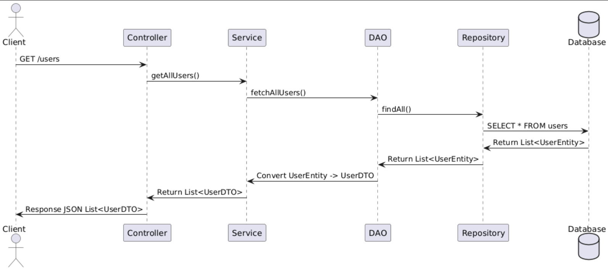

# **DTO (Data Transfer Object) Pattern in Java**

## **What is the DTO Pattern?**
- The **DTO (Data Transfer Object) pattern** is used to transfer data between different layers of an application (e.g., Controller → Service → DAO).
- It **decouples the entity from external layers**, ensuring that **only required data is shared**.
- DTOs **prevent exposing sensitive database fields** and optimize performance by transferring only relevant data.

---

## **Why Use DTOs?**
✅ **Security**: Prevents direct access to entity objects from external clients.  
✅ **Performance**: Transfers only necessary fields, reducing payload size.  
✅ **Encapsulation**: Hides internal database structure from external systems.  
✅ **Flexibility**: Allows different views of the same entity without modifying the database.

---

## **How to Implement the DTO Pattern in Java**
We’ll build a **User Management API** using the **DTO pattern**.

---

### **1️⃣ Define the Entity (Database Table)**
The **Entity class** represents the **database table**.

```java
import jakarta.persistence.*;

@Entity
@Table(name = "users")
public class UserEntity {

    @Id
    @GeneratedValue(strategy = GenerationType.IDENTITY)
    private Long id;

    private String name;
    private String email;
    private String password; // Sensitive field, should not be exposed in DTO

    // Constructors
    public UserEntity() {}
    public UserEntity(String name, String email, String password) {
        this.name = name;
        this.email = email;
        this.password = password;
    }

    // Getters & Setters
    public Long getId() { return id; }
    public void setId(Long id) { this.id = id; }

    public String getName() { return name; }
    public void setName(String name) { this.name = name; }

    public String getEmail() { return email; }
    public void setEmail(String email) { this.email = email; }

    public String getPassword() { return password; }
    public void setPassword(String password) { this.password = password; }
}
```
🔹 **Why Not Use Entity Directly?**
- The `password` field should **not be exposed** in API responses.
- The entity **contains more information than needed**, making responses **heavy**.

---

### **2️⃣ Create the DTO (Data Transfer Object)**
The **DTO class** represents the **data we want to expose**.

```java
public class UserDTO {
    private Long id;
    private String name;
    private String email;

    // Constructors
    public UserDTO() {}
    public UserDTO(Long id, String name, String email) {
        this.id = id;
        this.name = name;
        this.email = email;
    }

    // Getters & Setters
    public Long getId() { return id; }
    public void setId(Long id) { this.id = id; }

    public String getName() { return name; }
    public void setName(String name) { this.name = name; }

    public String getEmail() { return email; }
    public void setEmail(String email) { this.email = email; }
}
```
🔹 **Why Use a DTO?**
- **Excludes sensitive fields** like `password`.
- **Optimizes API responses** by sending only required data.

---

### **3️⃣ Create a Mapper Class (Convert Entity ↔ DTO)**
A **Mapper class** helps in converting **Entity → DTO** and vice versa.

```java
public class UserMapper {

    // Convert Entity to DTO
    public static UserDTO toDTO(UserEntity user) {
        return new UserDTO(user.getId(), user.getName(), user.getEmail());
    }

    // Convert DTO to Entity
    public static UserEntity toEntity(UserDTO userDTO) {
        return new UserEntity(userDTO.getName(), userDTO.getEmail(), null); // Password is not in DTO
    }
}
```
🔹 **Why Use a Mapper?**
- Keeps the **conversion logic centralized**.
- Makes code **cleaner and reusable**.

---

### **4️⃣ Create the Repository (Database Layer)**
The repository provides **database operations**.

```java
import org.springframework.data.jpa.repository.JpaRepository;
import org.springframework.stereotype.Repository;

@Repository
public interface UserRepository extends JpaRepository<UserEntity, Long> {
}
```

---

### **5️⃣ Implement the Service Layer**
The **service layer** interacts with the **DAO and DTO**.

```java
import org.springframework.beans.factory.annotation.Autowired;
import org.springframework.stereotype.Service;
import java.util.List;
import java.util.Optional;
import java.util.stream.Collectors;

@Service
public class UserService {

    @Autowired
    private UserRepository userRepository;

    // Fetch all users and convert to DTOs
    public List<UserDTO> getAllUsers() {
        return userRepository.findAll().stream()
                .map(UserMapper::toDTO)
                .collect(Collectors.toList());
    }

    // Fetch user by ID and convert to DTO
    public Optional<UserDTO> getUserById(Long id) {
        return userRepository.findById(id).map(UserMapper::toDTO);
    }

    // Create a new user from DTO
    public UserDTO createUser(UserDTO userDTO) {
        UserEntity userEntity = UserMapper.toEntity(userDTO);
        UserEntity savedUser = userRepository.save(userEntity);
        return UserMapper.toDTO(savedUser);
    }

    // Delete a user by ID
    public void deleteUser(Long id) {
        userRepository.deleteById(id);
    }
}
```
🔹 **What Happens Here?**
- Converts **Entity → DTO** when fetching data.
- Converts **DTO → Entity** when saving data.

---

### **6️⃣ Implement the Controller Layer**
The **Controller** handles HTTP requests.

```java
import org.springframework.beans.factory.annotation.Autowired;
import org.springframework.http.ResponseEntity;
import org.springframework.web.bind.annotation.*;

import java.util.List;
import java.util.Optional;

@RestController
@RequestMapping("/users")
public class UserController {

    @Autowired
    private UserService userService;

    // GET all users
    @GetMapping
    public List<UserDTO> getAllUsers() {
        return userService.getAllUsers();
    }

    // GET user by ID
    @GetMapping("/{id}")
    public ResponseEntity<UserDTO> getUserById(@PathVariable Long id) {
        Optional<UserDTO> user = userService.getUserById(id);
        return user.map(ResponseEntity::ok).orElseGet(() -> ResponseEntity.notFound().build());
    }

    // POST - Create new user
    @PostMapping
    public ResponseEntity<UserDTO> createUser(@RequestBody UserDTO userDTO) {
        UserDTO createdUser = userService.createUser(userDTO);
        return ResponseEntity.ok(createdUser);
    }

    // DELETE user by ID
    @DeleteMapping("/{id}")
    public ResponseEntity<Void> deleteUser(@PathVariable Long id) {
        userService.deleteUser(id);
        return ResponseEntity.noContent().build();
    }
}
```
🔹 **What Happens Here?**
- **Exposes APIs** for **GET, POST, and DELETE** operations.
- Uses **DTO instead of Entity** in responses.

---

## **How DTO Works in Spring Boot?**
| **Layer**      | **Purpose** |
|---------------|------------|
| **Entity (`UserEntity`)** | Represents **database table** |
| **DTO (`UserDTO`)** | Transfers **only required data** |
| **Mapper (`UserMapper`)** | Converts **Entity ↔ DTO** |
| **Repository (`UserRepository`)** | Provides **database CRUD operations** |
| **Service (`UserService`)** | Handles **business logic** |
| **Controller (`UserController`)** | Exposes **REST APIs** |

---

## **Testing the API**
Use **Postman** or a browser to test:

| **HTTP Method** | **Endpoint** | **Functionality** |
|---------------|-------------|----------------|
| `GET` | `/users` | Get all users |
| `GET` | `/users/{id}` | Get user by ID |
| `POST` | `/users` | Create a new user |
| `DELETE` | `/users/{id}` | Delete user by ID |

---

## **Why DTO is Important?**
✅ **Prevents exposing sensitive fields** (`password`).  
✅ **Optimizes performance** by sending **only required data**.  
✅ **Separates business logic** from the database.  
✅ **Makes APIs flexible** (different DTOs for different use cases).

---

### Would You Like an Example with Validation and Exception Handling?

## Flow Diagram :

